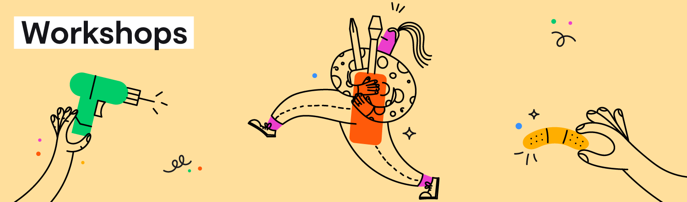

   
     
   <h1>Django on Platform.sh</h1>

<a href="#about"><strong>About</strong></a>&nbsp&nbsp&nbsp&nbsp&nbsp&nbsp
<a href="#workshops"><strong>Workshops</strong></a>&nbsp&nbsp&nbsp&nbsp&nbsp&nbsp
<a href="#contact"><strong>Contact</strong></a>&nbsp&nbsp&nbsp&nbsp&nbsp&nbsp
<a href="#contribute"><strong>Contribute</strong></a>&nbsp&nbsp&nbsp&nbsp&nbsp&nbsp
<a href="https://community.platform.sh"><strong>Join the community</strong></a>&nbsp&nbsp&nbsp&nbsp&nbsp&nbsp
 

&nbsp&nbsp
&nbsp&nbsp
&nbsp&nbsp
  

## About

Platform.sh is a unified, secure, enterprise-grade platform for building, running, and scaling fleets of websites and applications.
There are many resources available to help you get started running applications on the Platform, and this repository is meant to provide a number of half-day workshops to complement those materials. 

## Workshops

Depending on what you would like to learn, choose one of the available workshops below to start working with Platform.sh. 
The order of the workshops is presented as a kind of learning path - that is, you can start at the top of the list and work your way through each workshop for a full training.

### Platform.sh fundamentals

Lorem ipsum dolor sit amet, consectetur adipiscing elit. Nullam nibh odio, finibus a accumsan congue, posuere vitae dolor. In et placerat urna, sit amet imperdiet nunc. Morbi pulvinar eros velit, cursus vestibulum orci faucibus ac. In lobortis, urna vitae posuere porta, dui lorem gravida metus, egestas pharetra nulla neque at tortor. Aliquam vulputate ex eget erat luctus sollicitudin. Morbi scelerisque est et felis molestie viverra. Integer tempor pulvinar ipsum. Integer sit amet tristique mi. Proin vehicula justo id arcu consectetur, eget tincidunt eros commodo. Nulla iaculis nec orci eget vestibulum. Praesent et vehicula nisl, sit amet vestibulum magna.

Quisque congue elit eget risus condimentum malesuada. Aenean diam est, consectetur a lectus interdum, hendrerit facilisis erat. Integer in finibus diam, vitae aliquam tellus. Vestibulum sagittis ac leo id ornare. Morbi dapibus quis augue sit amet commodo. Curabitur eu fringilla justo. Nam a aliquet enim. In posuere ultricies venenatis. Pellentesque magna lacus, dapibus nec vehicula ultricies, tempor quis diam. Nunc hendrerit tempus velit, at ullamcorper elit vulputate vitae. Nunc pulvinar tellus non lacus commodo ornare. Vestibulum lobortis non diam at aliquam. Donec tempor finibus nisi finibus tempus.

    
<strong><a href="docs/fundamentals/README.md">Start the workshop</a></strong>

### Performance: Profiling best practices

*Coming soon.*

### Decoupling monotliths and frontend interchangeability

*Coming soon.*

### Managing a fleet of applications

Lorem ipsum dolor sit amet, consectetur adipiscing elit. Nullam nibh odio, finibus a accumsan congue, posuere vitae dolor. In et placerat urna, sit amet imperdiet nunc. Morbi pulvinar eros velit, cursus vestibulum orci faucibus ac. In lobortis, urna vitae posuere porta, dui lorem gravida metus, egestas pharetra nulla neque at tortor. Aliquam vulputate ex eget erat luctus sollicitudin. Morbi scelerisque est et felis molestie viverra. Integer tempor pulvinar ipsum. Integer sit amet tristique mi. Proin vehicula justo id arcu consectetur, eget tincidunt eros commodo. Nulla iaculis nec orci eget vestibulum. Praesent et vehicula nisl, sit amet vestibulum magna.

Quisque congue elit eget risus condimentum malesuada. Aenean diam est, consectetur a lectus interdum, hendrerit facilisis erat. Integer in finibus diam, vitae aliquam tellus. Vestibulum sagittis ac leo id ornare. Morbi dapibus quis augue sit amet commodo. Curabitur eu fringilla justo. Nam a aliquet enim. In posuere ultricies venenatis. Pellentesque magna lacus, dapibus nec vehicula ultricies, tempor quis diam. Nunc hendrerit tempus velit, at ullamcorper elit vulputate vitae. Nunc pulvinar tellus non lacus commodo ornare. Vestibulum lobortis non diam at aliquam. Donec tempor finibus nisi finibus tempus.

    
<strong><a href="docs/fleet/README.md">Start the workshop</a></strong>

## Contact

This repository is maintained by the Platform.sh Developer Relations team, and they will be notified of all issues and pull requests you open here.

- **Community:** Share your question with the community, or see if it's already been asked on our [Community site](https://community.platform.sh).
- **Slack:** If you haven't done so already, you can join Platform.sh's [public Slack](https://chat.platform.sh/) channels and ping the `@devrel_team` with any questions.

## Contribute

<h3 align="center">Help us improve our workshops!</h3>

Every one of our workshops is open source, and they're important resources for users trying to deploy to Platform.sh for the first time or better understand the platform. 

See something that's wrong with this repository that needs to be fixed? Something in the documentation unclear or missing? Let us know!

<strong>How to contribute</strong>
  
<a href="https://github.com/platformsh-workshops/django/issues/new?assignees=&labels=bug&template=bug_report.yml"><strong>Report a bug</strong></a>&nbsp&nbsp&nbsp&nbsp&nbsp&nbsp
<a href="https://github.com/platformsh-workshops/django/issues/new?assignees=&labels=feature+request&template=improvements.yml"><strong>Submit a feature request</strong></a>&nbsp&nbsp&nbsp&nbsp&nbsp&nbsp
<a href="https://github.com/platformsh-workshops/django/pulls"><strong>Open a pull request</strong></a>&nbsp&nbsp&nbsp&nbsp&nbsp&nbsp
 

 

<strong>Need help?</strong>
  
<a href="https://community.platform.sh"><strong>Ask the Platform.sh Community</strong></a>&nbsp&nbsp&nbsp&nbsp&nbsp&nbsp
<a href="https://chat.platform.sh"><strong>Join us on Slack</strong></a>&nbsp&nbsp&nbsp&nbsp&nbsp&nbsp
 

 
<h3 align="center"><strong>Thanks to all of our amazing contributors!</strong></h3>
 

 
