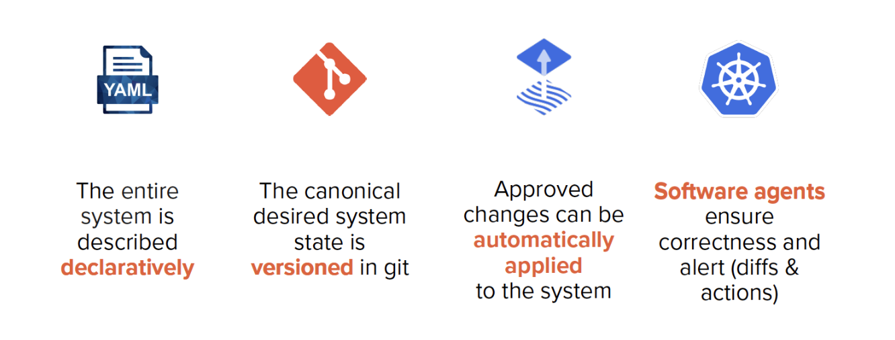
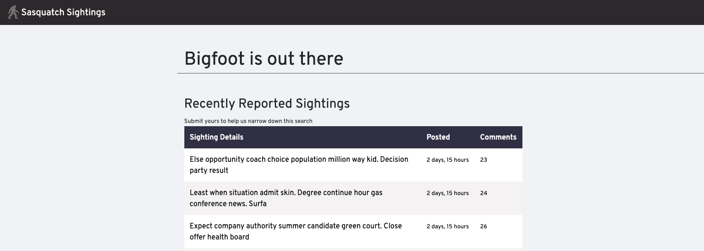

<div align="center">
   
   <br/><br/>
   <h1>Platform.sh fundamentals for Django</h1>
</div>

## About

DevOps engineers are often the sole key-holders of both environments and the understanding of how infrastructure dependencies are satisfied and updated. But what happens if they leave? And how easy are development environments to provision once you have hundreds of sites?

You’ll find those answers in this workshop, where you’ll approach DevOps differently for Django with Platform.sh. Each developer will configure infrastructure themselves with simple abstractions, and leverage tools they’re already using to provision environments on-demand.

### Outline

1. Introduction
1. Getting started
1. Running locally
1. Setting up Platform.sh with an integration
1. Adding Platform.sh configuration
1. Data and environments on Platform.sh
1. Writing and merging new features
1. Rolling back changes
1. Next steps

## Before the workshop

Before starting the workshop, there are a few requirements you will need to install and setup in order to follow the lesson.
Take a look at those requirements, then follow the steps listed below.

### Requirements

- A GitHub account
- Docker installed
- pipenv installed
- A Platform.sh account
- The Platform.sh CLI installed locally

### Steps

1. Create a Platform.sh account.

    Platform.sh provides a free one month trial, which will provide all of the resources you will need to go through these Getting Started guides.

    Before starting, be sure to [register for a trial Platform.sh account](https://auth.api.platform.sh/register) if you have not done so already. You can use your email address to register, or you can sign up using an existing GitHub, Bitbucket, or Google account. If you choose this option, you will be able to set a password for your Platform.sh account later.

    You will be given an option to create a project at this point (two options: Use a template and Create from scratch). Click the Cancel button in the right-hand corner of the screen for now - you will create a project later in the workshop.

1. Install the Platform.sh CLI:

    In addition to a Platform.sh account, this workshop uses the Platform.sh CLI. The CLI is the primary, and the most useful, tool for deploying applications and interacting with your projects.

    ```bash
    > curl -fsS https://platform.sh/cli/installer | php                 # Linux/MacOS
    > curl -f https://platform.sh/cli/installer -o cli-installer.php    # Windows
    > php cli-installer.php
    ```

1. Authenticate the CLI with your Platform.sh account:

    ```bash
    platform login
    ```

## Introduction

Lorem ipsum dolor sit amet, consectetur adipiscing elit. Nullam nibh odio, finibus a accumsan congue, posuere vitae dolor. In et placerat urna, sit amet imperdiet nunc. Morbi pulvinar eros velit, cursus vestibulum orci faucibus ac. In lobortis, urna vitae posuere porta, dui lorem gravida metus, egestas pharetra nulla neque at tortor. Aliquam vulputate ex eget erat luctus sollicitudin. Morbi scelerisque est et felis molestie viverra. Integer tempor pulvinar ipsum. Integer sit amet tristique mi. Proin vehicula justo id arcu consectetur, eget tincidunt eros commodo. Nulla iaculis nec orci eget vestibulum. Praesent et vehicula nisl, sit amet vestibulum magna.

<div align="center">
    <br/>
    
    <p width="60%"><em><strong>Core GitOps principles.</strong> Lorem ipsum dolor sit amet, consectetur adipiscing elit. Nullam nibh odio, finibus a accumsan congue, posuere vitae dolor. In et placerat urna, sit amet imperdiet nunc. Morbi pulvinar eros velit, cursus vestibulum orci faucibus ac.</em></p>
    <br/>
</div>

Quisque congue elit eget risus condimentum malesuada. Aenean diam est, consectetur a lectus interdum, hendrerit facilisis erat. Integer in finibus diam, vitae aliquam tellus. Vestibulum sagittis ac leo id ornare. Morbi dapibus quis augue sit amet commodo. Curabitur eu fringilla justo. Nam a aliquet enim. In posuere ultricies venenatis. Pellentesque magna lacus, dapibus nec vehicula ultricies, tempor quis diam. Nunc hendrerit tempus velit, at ullamcorper elit vulputate vitae. Nunc pulvinar tellus non lacus commodo ornare. Vestibulum lobortis non diam at aliquam. Donec tempor finibus nisi finibus tempus.

<div align="center">
    <br/>
    
    <p width="60%"><em><strong>A service graph on Platform.sh for Django.</strong> Shown is a cluster of containers, which make up a Platform.sh environment. In this workshop, and environment is made up of a single Router container for networking and request handling, an Application container using Python 3.9 that builds and deploys the Django app, and a PostgreSQL service container for the database.</em></p>
    <br/>
</div>

Lorem ipsum dolor sit amet, consectetur adipiscing elit. Nullam nibh odio, finibus a accumsan congue, posuere vitae dolor. In et placerat urna, sit amet imperdiet nunc. Morbi pulvinar eros velit, cursus vestibulum orci faucibus ac. In lobortis, urna vitae posuere porta, dui lorem gravida metus, egestas pharetra nulla neque at tortor. Aliquam vulputate ex eget erat luctus sollicitudin. Morbi scelerisque est et felis molestie viverra. Integer tempor pulvinar ipsum. Integer sit amet tristique mi. Proin vehicula justo id arcu consectetur, eget tincidunt eros commodo. Nulla iaculis nec orci eget vestibulum. Praesent et vehicula nisl, sit amet vestibulum magna.

Quisque congue elit eget risus condimentum malesuada. Aenean diam est, consectetur a lectus interdum, hendrerit facilisis erat. Integer in finibus diam, vitae aliquam tellus. Vestibulum sagittis ac leo id ornare. Morbi dapibus quis augue sit amet commodo. Curabitur eu fringilla justo. Nam a aliquet enim. In posuere ultricies venenatis. Pellentesque magna lacus, dapibus nec vehicula ultricies, tempor quis diam. Nunc hendrerit tempus velit, at ullamcorper elit vulputate vitae. Nunc pulvinar tellus non lacus commodo ornare. Vestibulum lobortis non diam at aliquam. Donec tempor finibus nisi finibus tempus.

## Getting started

Let's set up your copy of the repository for the workshop.

1. Clone this repository

    ```bash
    git clone git@github.com:platformsh-workshops/django.git
    ```

1. Create a new repository on GitHub, either through the UI, or with the GitHub CLI tool:

    ```bash
    gh repo create <YOUR_ACCOUNT>/django --public
    ```

1. Push the clone to your remote repository:

    ```bash
    cd django
    git remote rename origin upstream
    git remote add origin git@github.com:<YOUR_ACCOUNT>/django.git
    git push -u origin main
    ```

## Running locally

Now that you have the repository locally and remotely on GitHub, let's use Docker to take a look at it running locally.
 
1. Install requirements using `pipenv`:

   ```bash
   cd django
   pipenv install
   ```

1. Install PostgreSQL requirements (`pyscopg2`) if needed (You will see a `pg_config_executable not found` error during installation if needed):

   ```bash
   > brew install postgresql           # MacOS
   > sudo apt-get install postgresql   # Ubuntu
   ```

1. Start the PostgreSQL container:

    ```bash
    docker-composer up -d
    ```

1. Create the database:

    This repository's `settings.py` configures the database credentials by default as follows:

    ```python
    DATABASES = {
        'default': {
            'ENGINE': 'django.db.backends.postgresql',
            'NAME': 'bigfoot',
            'USER': 'bigfoot',
            'PASSWORD': 'bigfoot',
            'HOST': 'localhost',
            'PORT': '5432',
        }
    }
    ```

    Create the `bigfoot` database and user in the PostgreSQL container:

    ```bash
    > sudo -u postgres psql
    postgres> createdb bigfoot && createuser -s bigfoot
    ```

1. Perform migrations:

    ```bash
    pipenv run python manage.py migrate
    ```

1. Generate starter data in the database:

    ```bash
    pipenv run python manage.py generate_fake_data
    ```

1. Run the server

    ```bash
    pipenv run python manage.py runserver
    ```

<div align="center">
    <br/>
    
    <p width="60%"><em><strong>The workshop application running locally.</strong> Lorem ipsum dolor sit amet, consectetur adipiscing elit. Nullam nibh odio, finibus a accumsan congue, posuere vitae dolor.</em></p>
    <br/>
</div>


## Setting up on Platform.sh

1. Create your first empty project:

    ```bash
    platform create
    ```

    Follow the prompts to name the project, 

1. Get a GitHub token

1. Set up the integration

## Add Platform.sh configuration

1. Create a new branch to work from:

    ```bash
    git checkout -b platformify
    ```

1. Configure services:

1. Configure routes:

1. Configure application:

1. Commit and push to Platform.sh:

1. Test the data:

1. Merge into production:

1. Reseed production data: