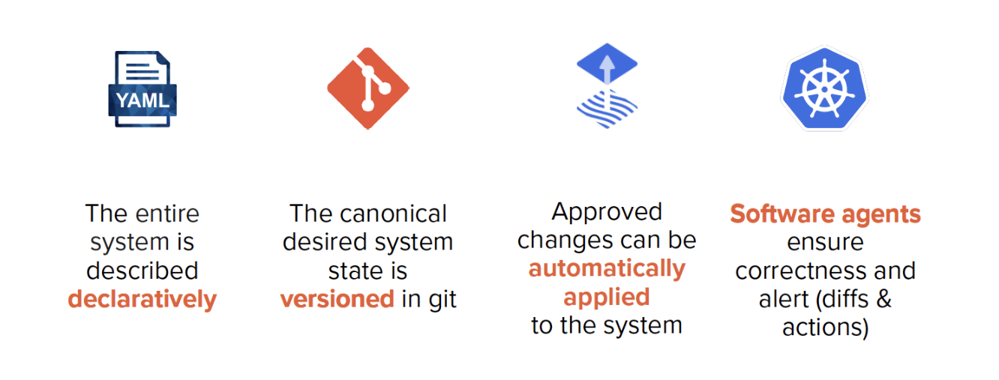
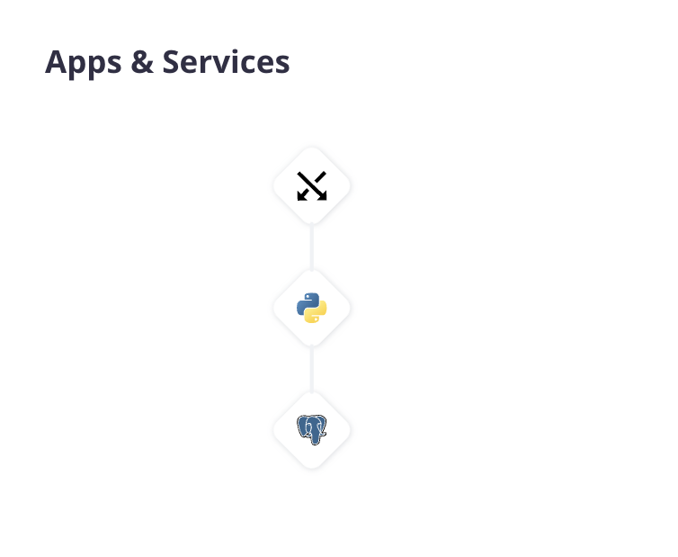

    
      
    <h1>Platform.sh fundamentals for Django</h1>
    <h4>Introduction</h4>

## Contents

- [Django basics](#django-basics)
- [This repository](#this-repository)
- [What is Platform.sh?](#what-is-platformsh)
- [Goals of this workshop](#goals-of-this-workshop)

## Django basics

Lorem ipsum dolor sit amet, consectetur adipiscing elit. Nullam nibh odio, finibus a accumsan congue, posuere vitae dolor. In et placerat urna, sit amet imperdiet nunc. Morbi pulvinar eros velit, cursus vestibulum orci faucibus ac. In lobortis, urna vitae posuere porta, dui lorem gravida metus, egestas pharetra nulla neque at tortor. Aliquam vulputate ex eget erat luctus sollicitudin. Morbi scelerisque est et felis molestie viverra. Integer tempor pulvinar ipsum. Integer sit amet tristique mi. Proin vehicula justo id arcu consectetur, eget tincidunt eros commodo. Nulla iaculis nec orci eget vestibulum. Praesent et vehicula nisl, sit amet vestibulum magna.

     
    
    
<em><strong>Core GitOps principles.</strong> Lorem ipsum dolor sit amet, consectetur adipiscing elit. Nullam nibh odio, finibus a accumsan congue, posuere vitae dolor. In et placerat urna, sit amet imperdiet nunc. Morbi pulvinar eros velit, cursus vestibulum orci faucibus ac.</em>

     

Quisque congue elit eget risus condimentum malesuada. Aenean diam est, consectetur a lectus interdum, hendrerit facilisis erat. Integer in finibus diam, vitae aliquam tellus. Vestibulum sagittis ac leo id ornare. Morbi dapibus quis augue sit amet commodo. Curabitur eu fringilla justo. Nam a aliquet enim. In posuere ultricies venenatis. Pellentesque magna lacus, dapibus nec vehicula ultricies, tempor quis diam. Nunc hendrerit tempus velit, at ullamcorper elit vulputate vitae. Nunc pulvinar tellus non lacus commodo ornare. Vestibulum lobortis non diam at aliquam. Donec tempor finibus nisi finibus tempus.

## This repository

Lorem ipsum dolor sit amet, consectetur adipiscing elit. Nullam nibh odio, finibus a accumsan congue, posuere vitae dolor. In et placerat urna, sit amet imperdiet nunc. Morbi pulvinar eros velit, cursus vestibulum orci faucibus ac. In lobortis, urna vitae posuere porta, dui lorem gravida metus, egestas pharetra nulla neque at tortor. Aliquam vulputate ex eget erat luctus sollicitudin. Morbi scelerisque est et felis molestie viverra. Integer tempor pulvinar ipsum. Integer sit amet tristique mi. Proin vehicula justo id arcu consectetur, eget tincidunt eros commodo. Nulla iaculis nec orci eget vestibulum. Praesent et vehicula nisl, sit amet vestibulum magna.

     
    
    
<em><strong>Core GitOps principles.</strong> Lorem ipsum dolor sit amet, consectetur adipiscing elit. Nullam nibh odio, finibus a accumsan congue, posuere vitae dolor. In et placerat urna, sit amet imperdiet nunc. Morbi pulvinar eros velit, cursus vestibulum orci faucibus ac.</em>

     

Quisque congue elit eget risus condimentum malesuada. Aenean diam est, consectetur a lectus interdum, hendrerit facilisis erat. Integer in finibus diam, vitae aliquam tellus. Vestibulum sagittis ac leo id ornare. Morbi dapibus quis augue sit amet commodo. Curabitur eu fringilla justo. Nam a aliquet enim. In posuere ultricies venenatis. Pellentesque magna lacus, dapibus nec vehicula ultricies, tempor quis diam. Nunc hendrerit tempus velit, at ullamcorper elit vulputate vitae. Nunc pulvinar tellus non lacus commodo ornare. Vestibulum lobortis non diam at aliquam. Donec tempor finibus nisi finibus tempus.

## What is Platform.sh?

Quisque congue elit eget risus condimentum malesuada. Aenean diam est, consectetur a lectus interdum, hendrerit facilisis erat. Integer in finibus diam, vitae aliquam tellus. Vestibulum sagittis ac leo id ornare. Morbi dapibus quis augue sit amet commodo. Curabitur eu fringilla justo. Nam a aliquet enim. In posuere ultricies venenatis. Pellentesque magna lacus, dapibus nec vehicula ultricies, tempor quis diam. Nunc hendrerit tempus velit, at ullamcorper elit vulputate vitae. Nunc pulvinar tellus non lacus commodo ornare. Vestibulum lobortis non diam at aliquam. Donec tempor finibus nisi finibus tempus.

     
    
    
<em><strong>A service graph on Platform.sh for Django.</strong> Shown is a cluster of containers, which make up a Platform.sh environment. In this workshop, and environment is made up of a single Router container for networking and request handling, an Application container using Python 3.9 that builds and deploys the Django app, and a PostgreSQL service container for the database.</em>

     

Lorem ipsum dolor sit amet, consectetur adipiscing elit. Nullam nibh odio, finibus a accumsan congue, posuere vitae dolor. In et placerat urna, sit amet imperdiet nunc. Morbi pulvinar eros velit, cursus vestibulum orci faucibus ac. In lobortis, urna vitae posuere porta, dui lorem gravida metus, egestas pharetra nulla neque at tortor. Aliquam vulputate ex eget erat luctus sollicitudin. Morbi scelerisque est et felis molestie viverra. Integer tempor pulvinar ipsum. Integer sit amet tristique mi. Proin vehicula justo id arcu consectetur, eget tincidunt eros commodo. Nulla iaculis nec orci eget vestibulum. Praesent et vehicula nisl, sit amet vestibulum magna.

Quisque congue elit eget risus condimentum malesuada. Aenean diam est, consectetur a lectus interdum, hendrerit facilisis erat. Integer in finibus diam, vitae aliquam tellus. Vestibulum sagittis ac leo id ornare. Morbi dapibus quis augue sit amet commodo. Curabitur eu fringilla justo. Nam a aliquet enim. In posuere ultricies venenatis. Pellentesque magna lacus, dapibus nec vehicula ultricies, tempor quis diam. Nunc hendrerit tempus velit, at ullamcorper elit vulputate vitae. Nunc pulvinar tellus non lacus commodo ornare. Vestibulum lobortis non diam at aliquam. Donec tempor finibus nisi finibus tempus.

## Goals of this workshop

Lorem ipsum dolor sit amet, consectetur adipiscing elit. Nullam nibh odio, finibus a accumsan congue, posuere vitae dolor. In et placerat urna, sit amet imperdiet nunc. Morbi pulvinar eros velit, cursus vestibulum orci faucibus ac. In lobortis, urna vitae posuere porta, dui lorem gravida metus, egestas pharetra nulla neque at tortor. Aliquam vulputate ex eget erat luctus sollicitudin. Morbi scelerisque est et felis molestie viverra. Integer tempor pulvinar ipsum. Integer sit amet tristique mi. Proin vehicula justo id arcu consectetur, eget tincidunt eros commodo. Nulla iaculis nec orci eget vestibulum. Praesent et vehicula nisl, sit amet vestibulum magna.

Quisque congue elit eget risus condimentum malesuada. Aenean diam est, consectetur a lectus interdum, hendrerit facilisis erat. Integer in finibus diam, vitae aliquam tellus. Vestibulum sagittis ac leo id ornare. Morbi dapibus quis augue sit amet commodo. Curabitur eu fringilla justo. Nam a aliquet enim. In posuere ultricies venenatis. Pellentesque magna lacus, dapibus nec vehicula ultricies, tempor quis diam. Nunc hendrerit tempus velit, at ullamcorper elit vulputate vitae. Nunc pulvinar tellus non lacus commodo ornare. Vestibulum lobortis non diam at aliquam. Donec tempor finibus nisi finibus tempus.

     
    

    <h3><a href="02-getstarted.md">Let's Git started!</a></h3>

